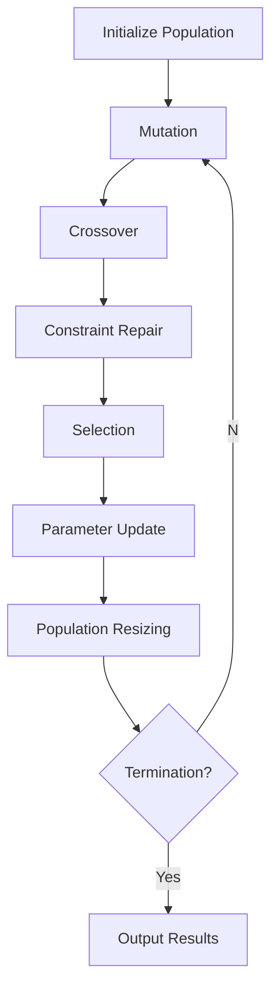

# SEvoBench DE Module Documentation

The `sevobench::de_module` provides a modular, extensible implementation of Differential Evolution (DE) algorithms in Modern C++20. This document describes its architecture, components, and usage patterns.

---

## 1. Overview
The DE module implements a framework for constructing DE variants through configurable components:
- **Mutation Strategies**: Classic/adaptive mutation operators
- **Crossover Schemes**: Binomial/exponential recombination
- **Parameter Controllers**: Adaptive F/CR mechanisms (JADE, SHADE, etc.)
- **Constraint Handling**: Boundary repair techniques
- **Population Management**: Dynamic resizing strategies
- **Archive Systems**: Historical solution storage (optional)

Designed for benchmarking and research, it supports both classic DE (DE/rand/1/bin) and modern variants (JADE, SHADE, TPB-DE).

---

## 2. Core Components

### 2.1 Mutation Strategies (`de_mutation.hpp`)
| Class                | Strategy                          | Formula                             |
|----------------------|-----------------------------------|-------------------------------------|
| `rand1_mutation`     | DE/rand/1                        | `v = x_r1 + F*(x_r2 - x_r3)`       |
| `best1_mutation`     | DE/best/1                        | `v = x_best + F*(x_r1 - x_r2)`     |
| `ttpb1_mutation`     | Target-to-pbest/1 (JADE)         | `v = x_i + F*(x_pbest - x_i) + F*(x_r1 - x_r2)` |
| `two_opt1_mutation`  | Two-opt mutation                 | `v = x_r0 + F*(x_r1 - x_r2)`       |

**Usage:**
```cpp
auto mutation = std::make_unique<ttpb1_mutation<double>>(0.11); // p=0.11
```

### 2.2 Crossover Schemes (`de_crossover.hpp`)
| Class                   | Type       | Characteristics              |
|-------------------------|------------|-------------------------------|
| `binomial_crossover`    | Binomial   | Independent dimension selection |
| `exponential_crossover` | Exponential| Contiguous segment crossover |

**Example:**
```cpp
auto crossover = std::make_unique<exponential_crossover<double>>();
```

### 2.3 Parameter Adaptation (`de_parameter.hpp`)
| Class               | Algorithm | Adaptation Mechanism         |
|---------------------|-----------|-------------------------------|
| `jade_parameter`    | JADE      | Current-to-pbest/1 + archive  |
| `shade_parameter`   | SHADE     | Historical memory + L-SHADE  |
| `constant_parameter`| Classic DE| Fixed F/CR values            |

**Configuration:**
```cpp
auto param = std::make_unique<jade_parameter<double>>(0.1, 0.5); // c=0.1, f=0.5
```

### 2.4 Constraint Handling (`de_constraint.hpp`)
| Class                   | Repair Method               |
|-------------------------|-----------------------------|
| `projection_repair`     | Clamp to bounds            |
| `reflection_repair`     | Reflect from boundaries    |
| `midpoint_base_repair`  | Reset to midpoint(base, bound) |

**Usage:**
```cpp
auto constraint = std::make_unique<projection_repair<double>>();
```

### 2.5 Population Management (`de_population.hpp`)
| Class                   | Strategy                  |
|-------------------------|---------------------------|
| `linear_reduction`      | Linear population decrease|
| `non_linear_reduction`  | Non-linear adaptive sizing|

**Example:**
```cpp
auto pop_strategy = std::make_unique<linear_reduction<double>>(alg, 50, 100);
```

---

## 3. Algorithm Configuration

### 3.1 DE Configuration Template
```cpp
template<bool Use_Archive, typename T>
struct de_config {
  std::unique_ptr<de_parameter<T>> parameter;
  std::unique_ptr<de_mutation<T>> mutation;
  std::unique_ptr<de_constraint<T>> constraint_handler;
  std::unique_ptr<de_crossover<T>> crossover;
  std::unique_ptr<de_population<T>> population_strategy;
  std::unique_ptr<de_archive<T>> archive; // Optional
};
```

### 3.2 Complete DE Setup
```cpp
// Configure JADE with archive
auto config = de_config<true, double>{
  .parameter = std::make_unique<jade_parameter<double>>(0.1, 0.5),
  .mutation = std::make_unique<ttpb1_mutation<double>>(0.11),
  .constraint_handler = std::make_unique<midpoint_base_repair<double>>(),
  .crossover = std::make_unique<binomial_crossover<double>>(),
  .population_strategy = std::make_unique<non_linear_reduction<double>>(alg, 50, 100),
  .archive = std::make_unique<fifo_archive<double>>(2.6)
};

// Initialize algorithm
de_algorithm<true, double> de(std::move(config));
```

---

## 4. Execution Workflow

### 4.1 Optimization Process


### 4.2 Key Methods
```cpp
// Main optimization loop
de.run(population, sphere_function, -5.0, 5.0, algorithm_tracker);

// Access results
auto best_solution = *std::min_element(population.begin(), population.end());
```

---

## 5. Advanced Features

### 5.1 Archive Systems (`de_archive.hpp`)
| Class            | Strategy                |
|------------------|-------------------------|
| `fifo_archive`   | First-In-First-Out     |
| `random_archive` | Stochastic replacement |

**Archive Usage:**
```cpp
auto archive = std::make_unique<random_archive<double>>(2.0); // Ratio=2.0
```

### 5.2 Adaptive Parameter Control
**JADE Parameter Adaptation:**
```math
\begin{aligned}
\mu_{CR} &\leftarrow (1-c) \cdot \mu_{CR} + c \cdot \text{mean}_A(CR)\\
\mu_{F} &\leftarrow (1-c) \cdot \mu_{F} + c \cdot \text{mean}_L(F^2)/\text{mean}_L(F)
\end{aligned}
```

**SHADE Memory Update:**
```math
M_{CR,k} = \frac{\sum (CR_i \cdot \Delta f_i)}{\sum \Delta f_i},\quad 
M_{F,k} = \frac{\sum (F_i^2 \cdot \Delta f_i)}{\sum (F_i \cdot \Delta f_i)}
```

---

## 6. API Reference

### 6.1 Core Classes
| Class                   | Responsibilities                |
|-------------------------|----------------------------------|
| `de_algorithm`          | Main optimization controller    |
| `evolutionary_algorithm`| FES/iteration tracking          |
| `population`            | Solution storage and management|

### 6.2 Key Methods
| Method                          | Description                          |
|---------------------------------|--------------------------------------|
| `de_algorithm::run()`           | Execute optimization loop           |
| `de_parameter::prepare()`       | Initialize F/CR values              |
| `de_mutation::mutate()`         | Generate donor vector               |
| `de_crossover::crossover()`     | Perform recombination               |

---

## 7. Benchmarking Example
```cpp
#include "SEvoBench/sevobench.hpp"

int main() {
  using namespace sevobench;
  using namespace de_module;
  // Define Sphere function
  auto sphere = [](const auto& x) {
    return std::inner_product(x.begin(), x.end(), x.begin(), 0.0);
  };

  // Configure JADE
  de_config<true, double> config{
    std::make_unique<jade_parameter<double>>(0.1, 0.5),
    std::make_unique<ttpb1_mutation<double>>(0.1),
    std::make_unique<projection_repair<double>>(),
    std::make_unique<binomial_crossover<double>>(),
    std::make_unique<linear_reduction<double>>(alg, 50, 100),
    std::make_unique<fifo_archive<double>>(2.0)
  };

  // Initialize algorithm
  de_algorithm<true, double> de(std::move(config));
  
  // Run optimization
  evolutionary_algorithm alg(10000, 50, 30); // max_fes=10^4
  population<double> pop(50, 30, -5.0, 5.0);
  de.run(pop, sphere, -5.0, 5.0, alg);

  // Output results
  auto best = *std::min_element(pop.begin(), pop.end());
  std::cout << "Best fitness: " << best.fitness() << std::endl;
}
```

---

## 8. Performance Considerations
- **Memory Efficiency**: Archive systems use `O(N)` additional memory
- **Computational Complexity**: 
  - Base DE: `O(N*D)` per iteration
  - JADE/SHADE: `O(N*D + A)` (A=archive size)
- **Parallelization**: Population evaluation can be trivially parallelized

---

## 9. Contribution Guidelines
1. Add new mutation/crossover strategies in respective headers
2. Implement parameter controllers using CRTP for policy-based design
3. Extend `de_archive` for novel historical selection methods
4. Maintain C++20 compatibility with concepts and ranges
5. Include unit tests for new components

---

