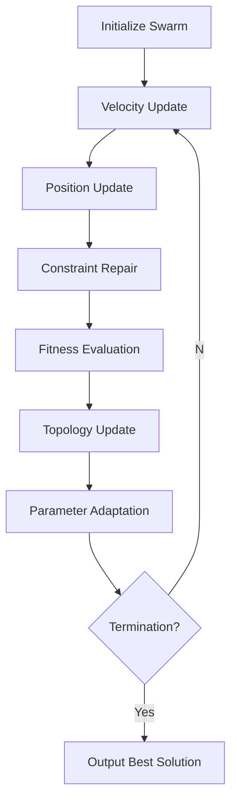

# SEvoBench PSO Module Documentation

The `sevobench::pso_module` provides a modular, extensible implementation of Particle Swarm Optimization (PSO) algorithms in Modern C++20. This document outlines its architecture, configurable components, and usage patterns.

---

## 1. Overview
The PSO module implements a framework for constructing various PSO variants through configurable components:
- **Topology Structures**: Global/local/random neighborhood topologies
- **Velocity Updates**: Inertia weight, bare-bones, FIPS, and spherical updates
- **Constraint Handling**: Velocity clamping and position repair
- **Swarm Management**: Dynamic population configurations
- **Parameter Control**: Adaptive inertia weight strategies

Designed for benchmarking and research, it supports classic PSO (gbest/lbest), modern variants (FIPS, BBPSO), and hybrid implementations.

---

## 2. Core Components

### 2.1 Topology Structures (`pso_topology.hpp`)
| Class                  | Type                  | Characteristics                    |
|------------------------|-----------------------|------------------------------------|
| `gbest_topology`       | Global Best           | Single best particle guides swarm  |
| `lbest_topology`       | Ring Topology         | 3-neighbor ring structure         |
| `random_topology`      | Dynamic Random       | K-random informants (adapts every M failures) |
| `von_neumann_topology`| 2D Grid               | 5-neighbor von Neumann grid       |

**Usage:**
```cpp
auto topology = std::make_unique<random_topology<double>>(10); // Reset after 10 stagnation
```

### 2.2 Update Strategies (`pso_update.hpp`)
| Class                             | Formula                              |
|-----------------------------------|--------------------------------------|
| `inertia_weight_update`          | `v = w*v + c1*r1*(pbest-x) + c2*r2*(gbest-x)` |
| `decrease_inertia_weight_update` | Linear w decrease from w_max to w_min |
| `bare_bone_update`               | `x ~ N(0.5*(pbest+gbest), |pbest-gbest|)` |
| `fips_update`                    | FIPS' fully informed particle swarm  |
| `spherical_update`               | Hypersphere-based directional update |

**Example:**
```cpp
auto update = std::make_unique<decrease_inertia_weight_update<double>>(alg, 0.4, 0.9, 2.05, 2.05);
```

### 2.3 Constraint Handling (`pso_constraint.hpp`)
| Class                       | Method                     |
|-----------------------------|----------------------------|
| `velocity_constraint`       | Base velocity repair       |
| `spso_velocity_constraint`  | Velocity clamping          |
| `positions_constraint`      | Position clamping          |

**Configuration:**
```cpp
auto v_constraint = std::make_unique<spso_velocity_constraint<double>>(-1.0, 1.0);
```

---

## 3. Algorithm Configuration

### 3.1 PSO Configuration Template
```cpp
template<std::floating_point T>
struct pso_config {
  std::unique_ptr<pso_update<T>> update;
  std::unique_ptr<pso_topology<T>> topology;
  pso_constraint<T> constraint_handler;
  
  void iterator(auto&& pop, auto&& vec, auto&& f, T lb, T ub, 
               evolutionary_algorithm& alg) noexcept {
    // Core iteration logic
  }
};
```

### 3.2 Builder Pattern Setup
```cpp
// Configure CLPSO with von Neumann topology
auto builder = pso_algorithm_builder<double>()
  .update(std::make_unique<inertia_weight_update<double>>(0.729, 1.494, 1.494))
  .topology(std::make_unique<von_neumann_topology<double>>())
  .constraint_handler(pso_constraint<double>{
    std::make_unique<spso_velocity_constraint<double>>(-2.0, 2.0),
    std::make_unique<positions_constraint<double>>()
  });

auto pso = builder.build();
```

---

## 4. Execution Workflow

### 4.1 Optimization Process


### 4.2 Key Methods
```cpp
// Main optimization loop
pso.run(population, rosenbrock_function, -5.0, 5.0, algorithm_tracker);

// Access best solution
auto& best = topology->best_solution();
```

---

## 5. Advanced Features

### 5.1 Dynamic Topologies
**Random Topology Adaptation:**
```cpp
random_topology<double> topology(5); // Rebuild topology after 5 stagnation
```

**Von Neumann Grid Configuration:**
```math
\text{Neighbors}(i,j) = \{(i±1,j), (i,j±1)\} \mod \text{grid\_size}
```

### 5.2 Parameter Adaptation
**Linear Inertia Weight Adjustment:**
```math
w(t) = w_{max} - (w_{max}-w_{min}) \times \frac{t}{T_{max}}
```

**Bare Bones Parameter Generation:**
```math
x_{ij}^{t+1} \sim \mathcal{N}\left(\frac{pbest_{ij} + gbest_j}{2}, |pbest_{ij} - gbest_j|\right)
```

---

## 6. API Reference

### 6.1 Core Classes
| Class                   | Responsibilities                |
|-------------------------|----------------------------------|
| `pso_algorithm`         | Main optimization controller     |
| `pso_algorithm_builder` | Type-safe configuration builder  |
| `pso_topology`          | Neighborhood management         |
| `pso_update`            | Velocity/position update rules  |

### 6.2 Key Methods
| Method                          | Description                          |
|---------------------------------|--------------------------------------|
| `pso_algorithm::run()`          | Execute optimization loop           |
| `pso_topology::prepare()`       | Initialize neighborhood structures  |
| `pso_update::update_velocity()` | Compute new velocity vector         |
| `pso_constraint::repair()`      | Apply boundary constraints          |

---

## 7. Benchmarking Example
```cpp
#include "SEvoBench/sevobench.hpp"

int main() {
  using namespace sevobench;
  using namespace pso_module;
  
  // Configure SPSO
  auto builder = pso_algorithm_builder<double>()
    .update(std::make_unique<decrease_inertia_weight_update<double>>(
      alg, 0.4, 0.9, 1.494, 1.494))
    .topology(std::make_unique<gbest_topology<double>>())
    .constraint_handler(pso_constraint<double>{
      std::make_unique<spso_velocity_constraint<double>>(-2.0, 2.0),
      std::make_unique<positions_constraint<double>>()
    });

  auto pso = builder.build();
  
  // Initialize parameters
  evolutionary_algorithm alg(10000, 50, 30); // max_fes=10^4
  population<double> pop(50, 30, -5.0, 5.0);
  
  // Run optimization
  pso.run(pop, sphere_function, -5.0, 5.0, alg);

  // Output results
  std::cout << "Best fitness: " << pso.topology()->best_value() << std::endl;
}
```

---

## 8. Performance Considerations
- **Memory Footprint**:
   - Base PSO: O(N*D) for positions/velocities
   - Topologies: O(N*K) for K-neighbor structures
- **Computational Complexity**:
   - Basic update: O(N*D) per iteration
   - Topology updates: O(N) to O(N^2) depending on type
- **Parallelization**: Fitness evaluation parallelizes naturally

---

## 9. Contribution Guidelines
1. Implement new topology structures inheriting `pso_topology`
2. Add velocity update strategies via `pso_update` subclassing
3. Develop constraint handlers using CRTP pattern
4. Maintain C++20 concepts for type safety
5. Include benchmark tests for new components
6. Document topology interaction matrices
7. Support both minimization and maximization modes

---